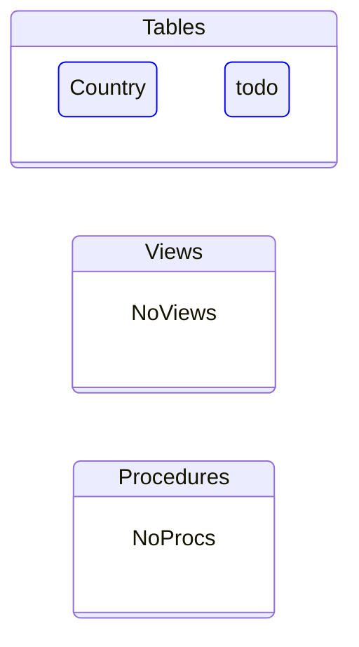

## dab-config.json

&nbsp;

```mermaid
stateDiagram-v2
direction LR

  classDef empty fill:none,stroke:none
  classDef table stroke:blue;
  classDef view stroke:red;
  classDef proc stroke:black;
  classDef phantom stroke:gray,stroke-dasharray:5 5;

  class NoTables empty
  class NoViews empty
  class NoProcs empty

  class Country table
  class todo table
  state Tables {
    Country
    todo
  }
  state Views {
    NoViews
  }
  state Procedures {
    NoProcs
  }
```

### Tables
|Entity|Source|Relationships
|-|-|-
|Country|dbo.CountryCodes|-
|todo|dbo.todo|-

### Views
> None

### Stored Procedures
> None

